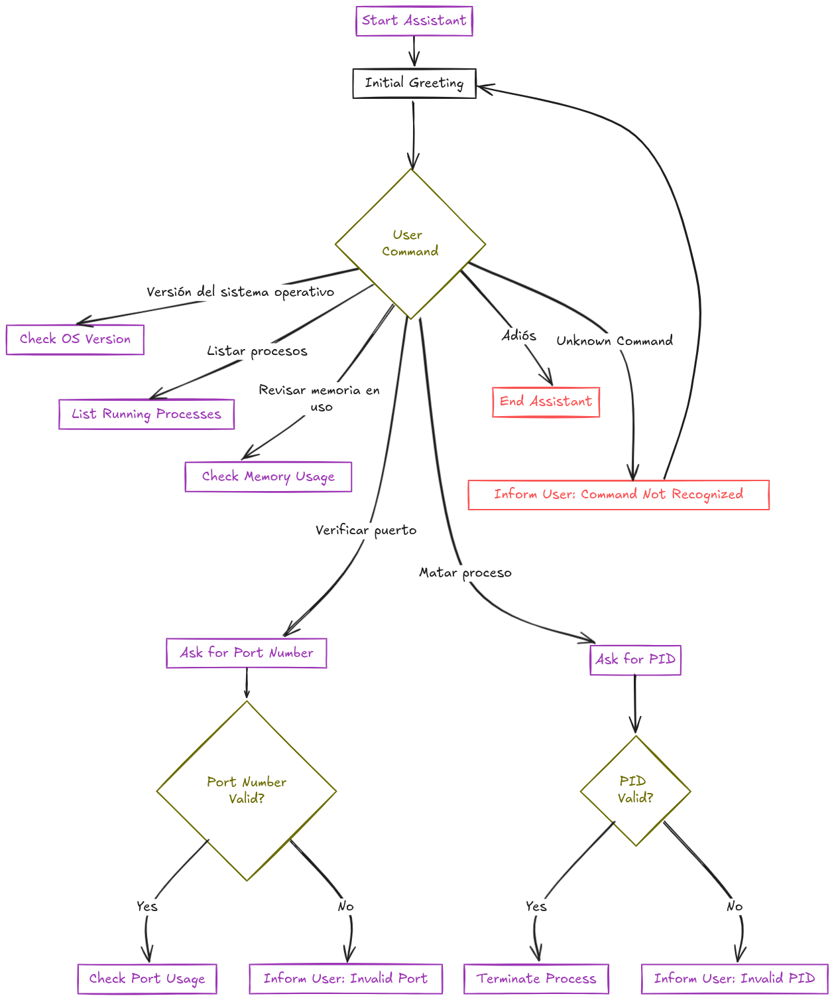

# Readme
## Libraries & Dependencies
Revisar version de python. Para escribir esta guia, yo estoy utilizando python 3.10
```sh
python --version
```

Creo un `virtual environment` con el comando `venv` de la siguiente manera. El primer paso es instalar `python3.10-venv`
```sh
apt install python3.10-venv
```

Utilicé el nombre de la carpeta del proyecto (pruebaAsistente) para cada prueba fuera única y estuviera aislada una de la otra.
```sh
python3 -m venv pruebaAsistente
```

Activar el entorno creado en el paso anterior
```sh
source pruebaAsistente\Scripts\activate
```
- Para desactivar:
```sh
deactivate
```

Instalar `python3-dev` que es una dependencia de la librería `PyAudio`
```sh
apt-get install python3-dev
```

Instalar PortAudio Development Headers
```sh
sudo apt-get install portaudio19-dev
```


Finalmente, instalar las librerías de las cuales el proyecto depende para poder correr
```sh
sudo pip install pyttsx3 SpeechRecognition psutil pyaudio
```

---

Instala FastAPI y Uvicorn
```sh
pip install fastapi uvicorn
```
- [[FastAPI]]. Framework web
- [[Uvicorn]]. servidor ASGI que ejecuta la app


---

## Running the App Stack
- aka: running *VA App* and *FastAPI App*.

### Activate python `venv` environment
ver [[#Libraries & Dependencies]]

### Run the FastAPI server using Uvicorn
```sh
uvicorn app:app --reload
```

> code above is somewhat similar to `nodemon` watch in NodeJS apps ecosystem

### Run the Voice Assistant App process
ejecutar el siguiente comando desde el directorio raíz del proyecto
```sh
python -m controllers.main_controller
```

---
### Casos de Uso
